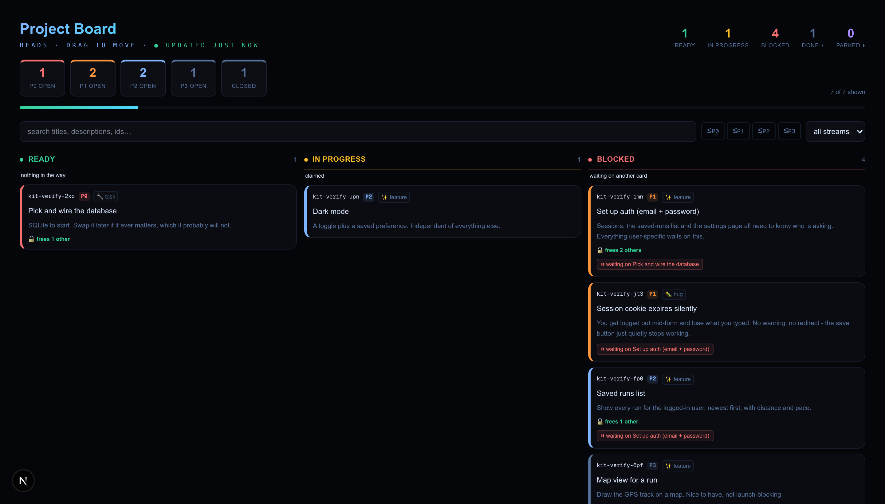
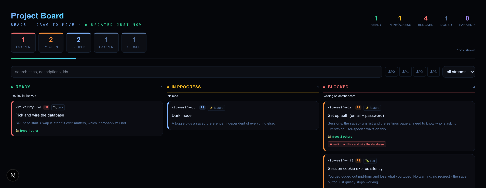
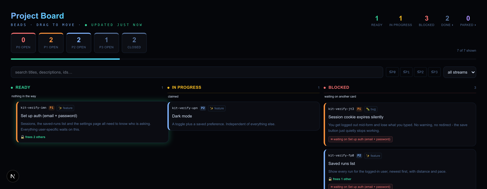
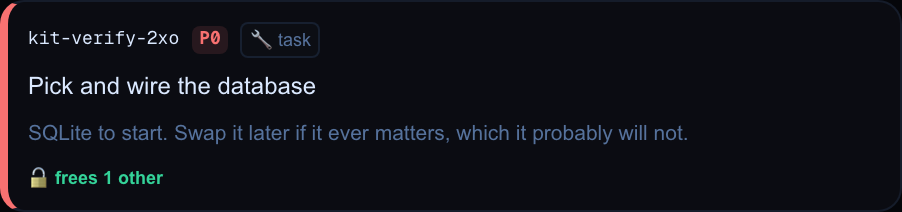

<div align="center">

# Kanban board for your AI agent

**A backlog your coding agent can actually reason about — including the one question a markdown checklist can never answer honestly: _what can I start right now?_**

`Next.js` · `React` · `TypeScript` · needs the [`bd`](https://github.com/steveyegge/beads) binary · no additional npm packages

[](LICENSE)
[](#licence-and-credit)

<br>



</div>

<br>

It reads [beads](https://github.com/steveyegge/beads) (`bd`) and never keeps its
own copy of anything. One source of truth, no second list to drift out of sync.

---

## The one thing it does that a checklist can't

**Ready and Blocked are not stored anywhere.** They are derived from the
dependency graph every time the board loads. Nobody maintains a "blocked" flag,
because nobody can be trusted to.

So when you close a blocker — from the terminal, from another window, from an
agent running in the background — the card it was holding **moves itself**,
within a few seconds and with nothing clicked in the browser.

<table>
<tr>
<td width="50%"><b>Before</b> — auth is stuck behind the database card</td>
<td width="50%"><b>A few seconds later</b> — nothing was clicked in the browser</td>
</tr>
<tr>
<td></td>
<td></td>
</tr>
</table>

```bash
bd close <the-blocker-id> -r "SQLite wired, verified by reading a row back."
```

<sub>These shots are a small seven-card example project made for this README —
not a capture of any other demo. Your own board will show your own numbers.</sub>

The card **travels** to its new column and **pulses green** on arrival, so the
change reads as cause and effect rather than as a page refresh. Then notice what
landed: the card that appeared is badged **`frees 2 others`** — it is worth *more*
than the one just finished. That is leverage, and it is invisible in a flat list.

---

## What makes it different from a to-do list

**Ready and Blocked are derived, not stored.** They're worked out from the
dependency graph every time the board loads. Nobody maintains a "blocked" flag,
because nobody can be trusted to. Close a blocker and the thing it was holding
moves itself.

That one property is why it works with an agent. "What should I do next" stops
being a judgement call and becomes a query.

The board also shows **leverage**: a card that frees three others sorts above one
that frees none, at the same priority. That's invisible in a flat list, and it's
usually the most useful thing on screen.

### The five columns, and where each one comes from

| Column | Comes from | Stored or derived |
| --- | --- | --- |
| **Ready** | `open` **and** listed by `bd ready` | derived |
| **In Progress** | status `in_progress` | stored |
| **Blocked** | `open` and **not** listed by `bd ready` | derived |
| **Done** | status `closed` | stored |
| **Parked** | status `deferred` | stored |

So beads stores four statuses (`open`, `in_progress`, `deferred`, `closed`) and
the board shows five columns — Ready and Blocked are the same stored status
split by the dependency graph.

**Parked is worth knowing about**, because it's the one you'd never guess from
the other four. It means *parked by choice* — you decided not to do this now.
That is a different fact from *blocked*, which means something else has to
happen first. Park a card with:

```bash
bd update <id> --status deferred
```

Parked cards are **collapsed by default** (click the column header to expand,
same as Done) and they're **left out of the outstanding-work count**, because
work you've deliberately shelved isn't a thing you're behind on.

The distinction matters more than it sounds. `bd ready` withholds deferred cards
exactly like it withholds blocked ones, so if you don't split them out, every
card you ever parked piles into Blocked and the board reports a backlog several
times more stuck than it is — a column reading nine when two are genuinely
blocked and seven were shelved on purpose.

If you don't want the fifth column, drop `deferred` from the column list in
`BeadsBoard.tsx` — but then send that status somewhere deliberate, or it falls
through to Blocked and the board lies to you.

---

## What's on a card



| | |
| --- | --- |
| **ID** | always visible, never hover-only — it is what you type at the CLI |
| **Priority** | colour-coded chip, plus a stripe down the left edge |
| **Type** | `feature` · `bug` · `task` · `chore` · `epic` · `decision` |
| **Description** | two lines of it, so one card looks different from the next at a glance |
| **`frees N others`** | how much work closing this releases |
| **`waiting on …`** | the specific card standing in the way |

On a **Done** card the description line is replaced by the close reason — once
something has shipped, *what changed* is more useful than *why we started*.

---

## Setup

> ## ⚠️ Run this on localhost. Do not put it on the internet.
>
> **`/api/beads` has no authentication of any kind.** Anyone who can reach that
> URL can claim, close, and reopen any card in your database, and read every
> card's full text. There's no login, no token, no check — it's one `fetch` away
> for whoever gets there.
>
> That's a deliberate trade for a tool that runs on your own machine next to
> your own terminal. It is a hole the moment the app is reachable by anything
> else. **Before you deploy this, or expose the dev server on your network, or
> tunnel it out to show someone — put real auth in front of the route.**
>
> Two things that are easy to get wrong:
>
> - `next dev` on `0.0.0.0` (or `--hostname`) means everyone on your wifi has
>   it. Coffee shop counts.
> - Deploying to normal serverless hosting doesn't just *risk* this — it can't
>   work at all. The route shells out to the `bd` binary and reads a database
>   that lives on your disk. Neither is up there.

### 1. Install beads

```bash
brew install beads
```

Or see the [beads repo](https://github.com/steveyegge/beads) for other platforms.

### 2. Initialise it in your project

```bash
cd your-project
bd init --skip-agents
```

**`--skip-agents` matters.** Without it, `bd init` rewrites your `AGENTS.md` /
`CLAUDE.md` with its own instructions. If you've written your own, it goes.
Back that file up before you run this either way.

Also worth knowing: `bd init` sets git's `core.hooksPath` to `.beads/hooks`.
If you have hooks in `.git/hooks`, **they stop running** — silently, with no
error and no warning. Move them into `.beads/hooks`, or the pre-commit checks
you rely on will quietly stop firing and commits you expect to be blocked will
sail straight through.

### 3. Copy the files in

**Copy them into your project's existing source root.** `create-next-app` asks
whether you want a `src/` directory, so there are two normal layouts and this kit
works with either — what matters is that `app/`, `components/` and `lib/` end up
as **siblings**, wherever your `app/` already lives.

Find your `app/` directory first. Then:

| Kit file | If your project has `src/` | If it doesn't |
| --- | --- | --- |
| `app/board/page.tsx` | `src/app/board/page.tsx` | `app/board/page.tsx` |
| `app/api/beads/route.ts` | `src/app/api/beads/route.ts` | `app/api/beads/route.ts` |
| `components/BeadsBoard.tsx` | `src/components/BeadsBoard.tsx` | `components/BeadsBoard.tsx` |
| `lib/board-order.ts` | `src/lib/board-order.ts` | `lib/board-order.ts` |
| `lib/board-order.test.ts` | `src/lib/board-order.test.ts` | `lib/board-order.test.ts` |
| `lib/http.ts` | `src/lib/http.ts` | `lib/http.ts` |
| `lib/http-error.ts` | `src/lib/http-error.ts` | `lib/http-error.ts` |

**Then check the `@/*` alias points at that same root.** The imports are written
as `@/lib/board-order`, and `@/` has to resolve to whichever root you just
copied into — otherwise the imports don't find anything. In `tsconfig.json`:

```jsonc
// with src/
"paths": { "@/*": ["./src/*"] }

// without src/
"paths": { "@/*": ["./*"] }
```

`create-next-app` writes the right one for the layout you chose, so usually
there's nothing to do here — just confirm it matches before you go debugging an
import error. If your project has no alias at all, add one, or rewrite the two
`@/` imports in `route.ts` as relative paths.

### 4. Add the styles

The board uses CSS variables. Paste these into your global stylesheet — change
the colours to whatever you like, but they need to exist:

```css
/* --- Kanban board styles. All of it is required; nothing here is optional
   decoration. The board renders without these, but you lose the card surface,
   the header, and the green flash that shows which card just became unblocked
   — which is the one thing this board does that a checklist can't. --- */

:root {
  --background: #05060a;
  --foreground: #dbe9ff;
  --surface: #0c0e14;
  --border: rgba(90, 140, 210, 0.15);
  --muted: #56729c;
  --accent: #6366f1;
  --hud-blue: #7fb4ff;
  --hud-cyan: #4fd6ff;
  --hud-green: #34d399;
}

body { background: var(--background); color: var(--foreground); }

/* Card and panel surface. */
.hud-card {
  position: relative;
  background: rgba(12, 14, 20, 0.8);
  border: 1px solid rgba(90, 140, 210, 0.12);
  border-radius: 12px;
  backdrop-filter: blur(12px);
  transition: all 0.3s cubic-bezier(0.4, 0, 0.2, 1);
}
.hud-card:hover {
  border-color: rgba(90, 140, 210, 0.25);
  box-shadow: 0 0 30px rgba(79, 214, 255, 0.04), 0 8px 32px rgba(0, 0, 0, 0.3);
  transform: translateY(-1px);
}

/* Page title and the small uppercase label under it. */
.gradient-text {
  background: linear-gradient(135deg, var(--hud-blue), var(--hud-cyan), #a855f7);
  -webkit-background-clip: text;
  -webkit-text-fill-color: transparent;
  background-clip: text;
}
.hud-label {
  font-family: ui-monospace, SFMono-Regular, Menlo, monospace;
  font-size: 10px;
  letter-spacing: 0.35em;
  text-transform: uppercase;
  color: var(--hud-blue);
}

.btn-gradient {
  background: linear-gradient(135deg, #6366f1, #a855f7);
  color: white;
  border: none;
  transition: all 0.3s;
}
.btn-gradient:hover { background: linear-gradient(135deg, #a855f7, var(--hud-cyan)); }
.text-muted { color: var(--muted); }

/* --- Movement. This is the part worth not skipping. ---

   Cards animate between columns with a FLIP transform applied in JS;
   `will-change` keeps that smooth. When a card changes column it also gets
   data-arrived="1" for a moment, which fires one green pulse. Without these
   rules the board still updates correctly — the card just teleports, which
   reads as a page refresh instead of as cause and effect. */
.board-card { will-change: transform; }

@keyframes card-arrived {
  0% {
    box-shadow: 0 0 0 0 rgba(52, 211, 153, 0.55),
                0 0 22px 4px rgba(52, 211, 153, 0.35);
  }
  100% {
    box-shadow: 0 0 0 0 rgba(52, 211, 153, 0),
                0 0 0 0 rgba(52, 211, 153, 0);
  }
}
.board-card[data-arrived="1"] { animation: card-arrived 1.5s ease-out; }

/* Two lines of description on a card, then an ellipsis. */
.line-clamp-2 {
  display: -webkit-box;
  -webkit-line-clamp: 2;
  -webkit-box-orient: vertical;
  overflow: hidden;
}
```

It's Tailwind-flavoured markup. Without Tailwind the layout won't hold together,
but the board will still function.

---

## Verify it actually works

Don't trust it until it answers. A dropped file is the easiest thing to get wrong
here and the hardest to spot — `http.ts` imports `http-error.ts`, so miss that
one and the board fails on an import that has nothing to do with beads.

Run these in order:

```bash
# 1. beads itself responds
bd ready --limit 0

# 2. make two cards where one blocks the other
bd create "the blocker" -p 1
bd create "the blocked thing" -p 1
bd dep add <blocked-id> <blocker-id>

# 3. the API sees them
curl -s localhost:3000/api/beads | head -c 300
```

Then open `/board`. You should see:

- **the blocker in Ready**, with a `🔓 frees 1 other` badge
- **the blocked thing in Blocked**, saying what it's waiting on
- now run `bd close <blocker-id> -r "done"` in the terminal and **touch nothing
  in the browser** — within a few seconds the blocked card moves to Ready on its
  own. The board polls every 2.5 seconds, so no reload is needed.

That last step is the whole point: a change made outside the browser reorganises
the board without anyone telling it to. If it doesn't happen, the dependency
didn't register — check `bd show <id>` before debugging the UI.

---

## Run the tests

`lib/board-order.test.ts` ships with the kit. No test framework, nothing to
install — Node runs the TypeScript directly.

**One tsconfig change first.** The test imports `./board-order.ts` *with* the
extension, because that is what Node requires when it strips types itself.
TypeScript rejects that by default, so add this to `compilerOptions` in
`tsconfig.json`:

```jsonc
"allowImportingTsExtensions": true
```

It is safe in a Next project — it only requires `noEmit: true`, which Next
already sets. Skip it and `npx tsc --noEmit` fails on the test file even though
the test itself runs fine.

Then:

```bash
# with src/
node --test src/lib/board-order.test.ts

# without src/
node --test lib/board-order.test.ts
```

Or wire it into `package.json` so it's one word:

```jsonc
"scripts": {
  "test": "node --test lib/board-order.test.ts"
}
```

Six checks, all of which should pass. Needs Node 22.6+ for the built-in type
stripping. If your `package.json` has no `"type": "module"` a
`MODULE_TYPELESS_PACKAGE_JSON` warning prints above the output — noisy,
harmless, and the tests still pass. Both layouts work, with or without the field.

**The sixth check is the interesting one.** Five of them test the comparator in
`board-order.ts`. The sixth reads `route.ts` and asserts that the sort runs
*after* the graph walk that fills in `unblocks`, which is a thing no unit test
can see.

It's worth understanding why that check exists, because it guards the failure
mode this code is most exposed to. A correct comparator that runs too early is
indistinguishable from a working sort: every card compares as zero leverage, the
ordering does nothing at all, and the `frees 3 others` badge beside it still
renders perfectly. Nothing errors. Nothing looks wrong. So if you rearrange
`route.ts`, that ordering is the thing to protect — and a unit test of the
comparator will keep passing while the board silently stops sorting.

That is the failure mode to watch for generally. Not code that errors — code
that runs, returns, and quietly has no effect.

The sixth check finds `route.ts` by path (`../app/api/beads/route.ts`, relative
to the test). If you rearranged things it prints a *skipped* line instead of
failing. Repoint it if you can — it's the check that earns its place.

---

## Things that will bite you

**`bd ready` has a default result limit.** The route calls it with
`--limit 0` for a reason. Without that, past ~100 issues the ready list
silently truncates and real ready work gets reported as *blocked* — a wrong
board with no error.

**`bd close` takes `-r`, not a positional.** `bd close abc123 "did the thing"`
reads `"did the thing"` as *another issue ID* and fails. It's `bd close abc123
-r "did the thing"`.

**Sort after you walk the graph, not before.** The leverage sort reads a field
the dependency walk fills in, so moving it earlier makes it silently inert. The
sixth test guards this — see [Run the tests](#run-the-tests) for why it matters.

**The API can send more than the board draws.** Beads stores an owner email
address on every card, plus an assignee and creator name. The UI renders none of
them, but they travel in the JSON regardless — so anyone who opens DevTools, or
screen-records with the network tab up, publishes an email address that nothing
on the page ever needed. `route.ts` strips `owner`, `assignee` and `created_by`
before responding. Note that it strips them from the nested `dependencies[]`
rows too, which is easy to overlook: each dependency edge carries its own
`created_by`, so a top-level-only strip leaves one copy per edge behind while
inspecting the parsed card keys reports everything clean. If you want any of
those fields back, remove it from `PERSONAL_FIELDS` deliberately.

---

## Using it with an agent

Four habits that make the difference between a board that helps and a board that
becomes another thing to maintain:

- **Claim before starting**: `bd update <id> --claim`. With more than one agent
  running, this is what stops two of them opening the same file.
- **Close with a real reason.** `-r "what changed and how you proved it"`. The
  Done column becomes the only record of *why* something was done, and a wall of
  "closed from the board" is worth nothing three weeks later.
- **Every bug found gets a card, immediately** — even mid-task, even small. The
  ones that don't get written down don't get fixed.
- **Let dependencies do the sequencing.** Don't order the work by hand; add the
  dependency and let Ready tell you what's actually startable.

---

## Licence and credit

**[MIT](LICENSE).** Use it, change it, ship it, sell it — commercial or not, no
permission needed. The only condition MIT actually enforces is that the licence
file, with its copyright line, travels with the code.

Built by **Drew (D Tech)**, who wanted to see what his AI was actually doing all
day — and got tired of asking.

If it saves you an afternoon, a link back is appreciated but never required —
that part is a courtesy, not a term of the licence.
